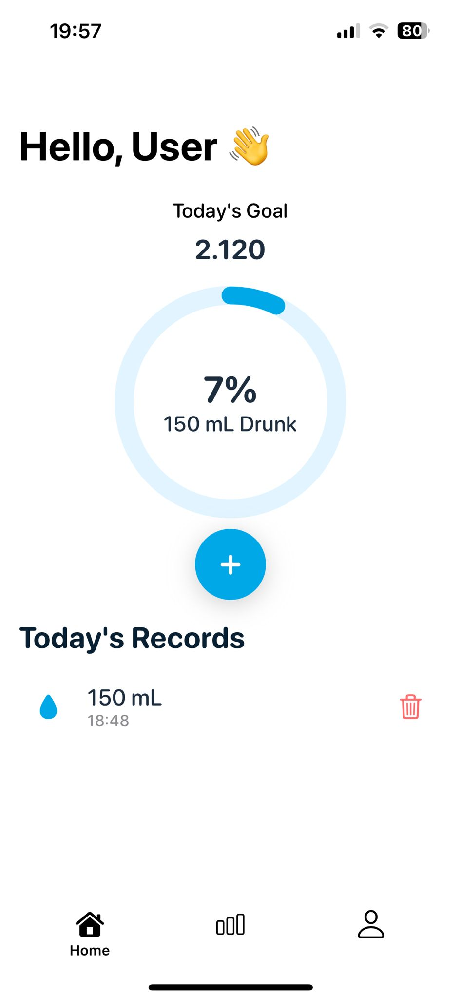
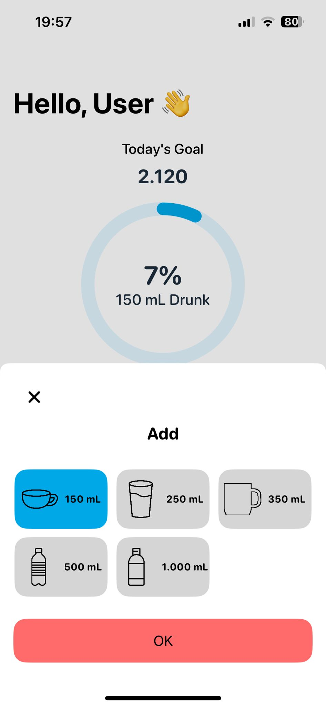
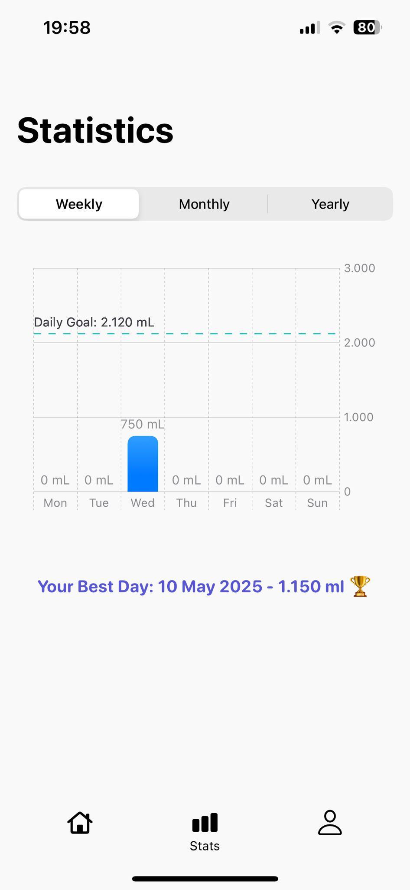
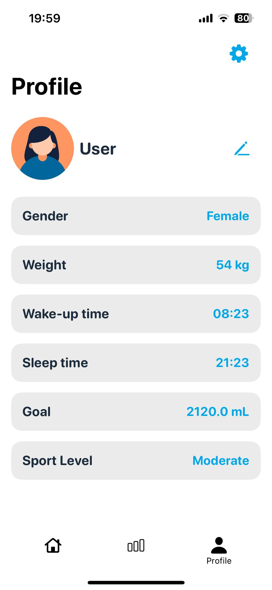
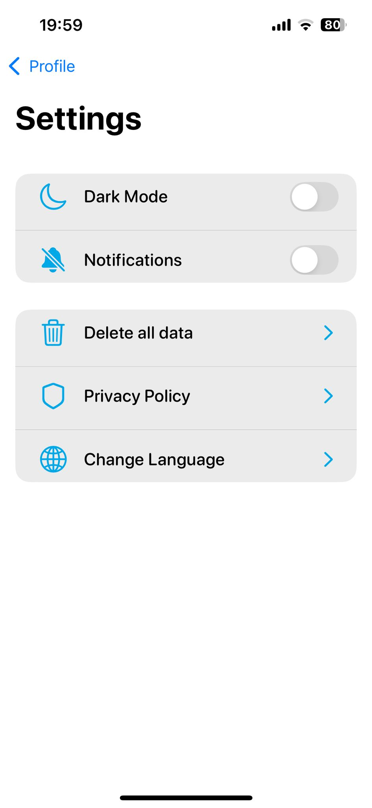

# Waterly
Waterly is a simple, user-friendly iOS app that lets you track your daily water intake in a tidy and effective way. It offers personalized water goals based on your weight, gender, and daily routine. The app also visualizes your progress with weekly, monthly, and yearly charts.

## 📸 Screenshots

Home Page | Add Button | Stats | Profile | Settings
:-------------------------:|:-------------------------:|:-------------------------:|:-------------------------:|:-------------------------:
 |  |  |  | 

